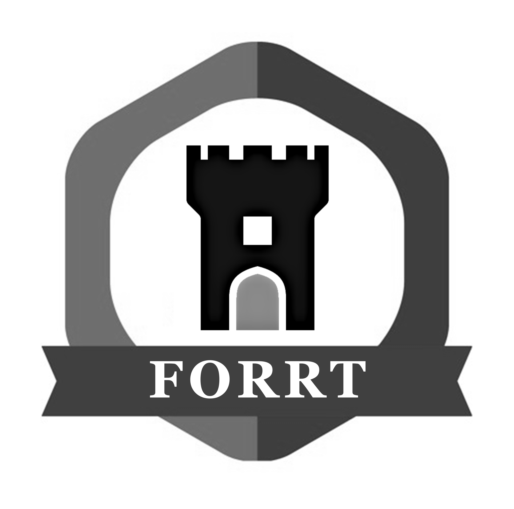
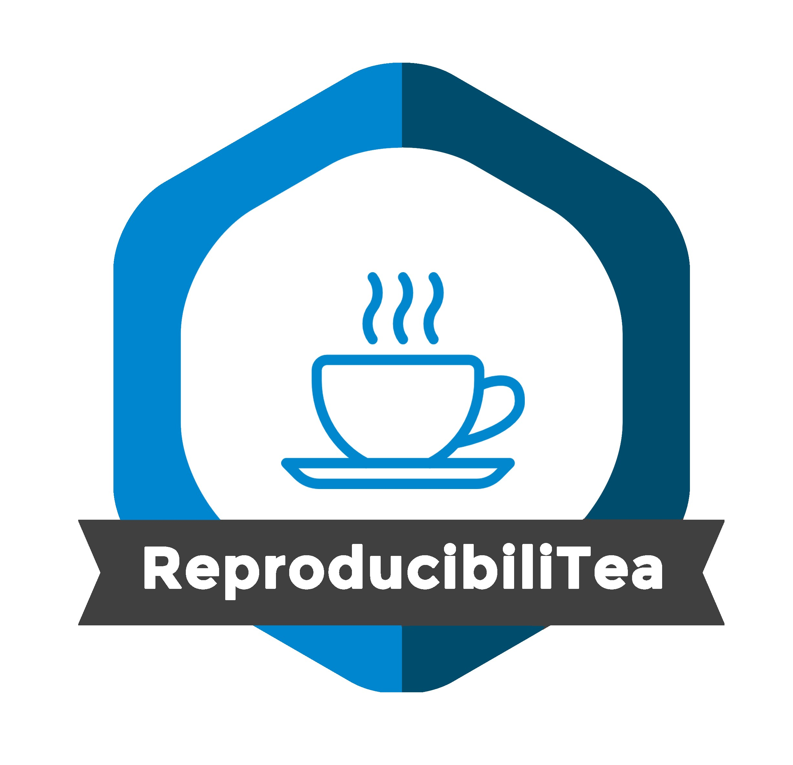
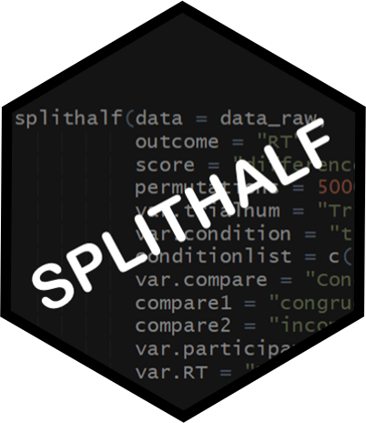

# [<i class="fab fa-twitter"></i>](https://twitter.com/sam_d_parsons) [<i class="ai ai-google-scholar"></i>](https://scholar.google.co.uk/citations?user=kE37Xy4AAAAJ&hl=en) [<i class="ai ai-orcid"></i>](https://orcid.org/0000-0002-7048-4093) [<i class="ai ai-osf"></i>](https://osf.io/k7akr/) [<i class="ai ai-researchgate"></i>](https://www.researchgate.net/profile/Sam_Parsons4) [<i class="fab fa-github"></i>](https://github.com/sdparsons) [<i class="ai ai-publons"></i>](https://publons.com/researcher/1351322/sam-parsons/) [<i class="fab fa-youtube"></i>](https://www.youtube.com/channel/UC3C_BRgKQNqZH2P2R5U2cfw) [<i class="fas fa-envelope-square"></i>](mailto:sam.parsons@radboudumc.nl) [<i class="ai ai-cv"></i>](Sam_Parsons_cv.pdf)

**About me** I am a [Radboud Excellence Initiative](https://www.ru.nl/excellence/) Postdoctoral Research Fellow. I work in the [Lifespan Cognitive Dynamics Lab](https://www.rogierkievit.com/) based at the [Donders Institute](https://www.ru.nl/donders/). I did my DPhil in Experimental Psychology at the University of Oxford^[a DPhil is a PhD but of course they need to call it something else]

**My current work** is focused on the reliability of longitudinal structural brain imaging data across brain regions, structural measures, and studies. My aim is to support developmental cognitive neuroscience study changes in brain structure and function by focusing on sources of reliability and error. My core approach will be based on intra-class effect decomposition, closely tied to generalisability theory. These models extract sources of variation in order to explore where the variation/error comes from in the model, moving beyond a single metric of reliability (e.g. ICC for test-retest). I believe it is important to support others who may want to use these approaches, so I will be dedicating time to share code and develop tutorials.

I am happy to be contacted to discuss reliability of cognitive measures - particularly if you have questions about my splithalf package (see below) and need assistance with it.

**Open Scholarship** I try to do my own small bit for the improvement of psychological science and open scholarship. Amy Orben, Sophia Cruwell, and I co-founded the [ReproducibiliTea Journal Clubs](https://reproducibilitea.org/) - now a large international community of Journal Clubs where folks talk about openness, reproducibility, and improving research practices. Flavio Azevedo and I also co-founded a [Framework for Open and Reproducible Research Training](https://forrt.org/) (FORRT), a pedagogy-focused community working to support those seeking to incorporate open and reproducible practices into their teaching and mentoring. 

{ width=40% } { width=40% }

Eventually, I will get around to loading my previous projects & talks here. In the meantime, I have most of my talk slides on the [OSF](https://osf.io/rfy2h/), and you can check out my [CV](Sam_Parsons_cv.pdf). I do try to keep this website up to date, however it may fall behind my CV.

---------------------------

## splithalf

Estimate the internal consistency of your tasks with a permutation based split-half reliability approach.

Latest version: 0.8.1 “Rum Ham”^[Yes, all of the version names I have given the package are references to It's Always Sunny in Philadelphia. The pointlessness amuses me, and academia is often too serious, so count this as a minor act of rebellion]

[<i class="fab fa-github"></i> Github documentation](https://github.com/sdparsons/splithalf)

Now published in the [Journal of Open Source Software](https://joss.theoj.org/papers/10.21105/joss.03041)

{ width=50% }

---------------------------

## Consulting

I am available for resesarch consulting. Contact me if you are interested and we can discuss projects, timescales, and costings. 

I have experience in research consulting for: study design and implementation, statistics, and programming in R.
